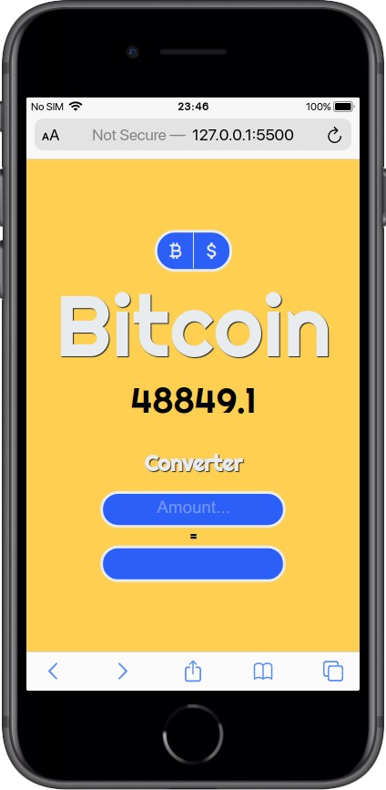

# CurrencyToday

  
  
  
  

A simple project consuming an API to check current currencies prices and convert to between them

## Technologies

- HTML5
- CSS3
- JavaScript

## Project Preview

Preview link: <a href="https://diegosouza007.github.io/CurrencyToday">https://diegosouza007.github.io/CurrencyToday</a>